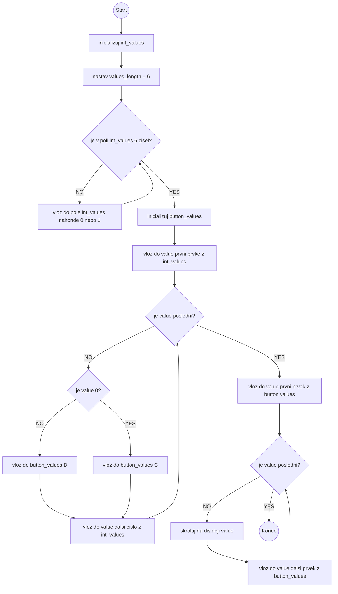

# Lekce 5
### Seznamy, indexace, foreach

## Obsah
[Motivace](#motivace)  
[Prostředky I - Seznam, indexace ](#resources1)  
[Úloha 1 - Seznamy](#assignment1)  
[Prostředky II - ](#resources2)  
[Úloha 2 - Memory test](#assignment2)  
[Shrnutí](#conclusion)  
[Poznámky pro učitele](#pozn)  

## Motivace <a name="motivace"/>
Seznamy jsou jednou z nejdůležitějších datových struktur, umožňují ukládat hodnoty a manipulovat s nimi, což je velmi užitečné v mnoha různých typech programů. Seznamy mohou být použity pro ukládání seznamů uživatelských vstupů, výsledků zpracování dat, seznamu položek k nákupu, seznamu přátel na sociální síti a mnoho dalších.
## Prostředky I - <a name="resources1"/>
V Pythonu jsou seznamy jedním z nejčastěji používaných datových typů. Seznam umožňuje ukládat a pracovat s více hodnotami najednou, které mohou být různých datových typů. Seznamy jsou v Pythonu reprezentovány hranatými závorkami [] a jednotlivé prvky jsou odděleny čárkami.

Například, zde je příklad vytvoření seznamu čísel:
```python
cisla = [1, 2, 3, 4, 5]
```
Seznamy mohou být prázdné, nebo mohou obsahovat libovolný počet prvků. K prvkům seznamu lze přistupovat pomocí indexu. Index prvního prvku v seznamu je 0. Index může být i záporný, což znamená, že začíná od konce seznamu. Kromě toho mohou být prvky seznamu přidávány, mazány a modifikovány. 
Nad seznamy lze provádět několik základních operací:
- přidat prvek na konec seznamu `nazev_seznamu.append(prvek)`
- zjistit délku seznamu pomocí funkce `len(nazev_seznamu)`
- zjistit zda je prvek v seznamu `prvek in nazev_seznamu`
- zjistit počet výskytů daného prvku `nazev_seznamu.count(prvek)`
- přistoupit ke konkrétnímu prvku pomocí indexu `nazev_seznamu[index]`
- vybrat ze seznamu podseznam `nazev_seznamu[1:3]`
- odstranit ze seznamu poslední prvek a vrátit ho `nazev_seznamu.pop()`
## Úloha 1 - Seznamy <a name="assignment1"/>
### Zadání
Vytvořte vhodně pojmenovaný seznam délky šest do něhož budete pomocí `random.randint()` náhodně generovat 0 a 1. Na jeho základě pak vytvořte jiný seznam, který bude obsahovat znak "C" tam, kde byla 0 a znak "D" na indexech, kde v původním seznamu byla 1. Poté nový seznam postupně zobrazte na displej micro:bita.
### Co budete potřebovat
Pro tuto úlohu nejsou potřeba žádné moduly.
### Co se naučíte
Cílem úlohy je naučit žáky pracovat se seznamy. Vytvořit seznam, přidávat do něho prvky a procházet seznam pomocí hodnot i indexů. Úloha je přípravou pro úlohu dva.
### Jak postupovat
Tento úkol můžete vytvořit společně se studenty nebo je nechat pracovat samostatně. Pokud budou pracovat sami, nejprve vysvětlete jak funguje metoda `randint()`. Randint je funkce z knihovny `random`, proto je potřeba nejprve modul naimportovat. Randint generuje (pseudo) náhodné celočíselné hodnoty v určeném rozsahu. Syntaxe funkce randint je následující `random.randint(start, end)`, kde `start` a `end` jsou celočíselné hodnoty, které určují počátek a konec rozsahu (včetně krajních hodnot intervalu).

Aby bylo možné hodnoty přidávat do seznamu, je potřeba seznam nejprve vytvořit. Následně ve for cyklu s počtem opakování 6 do vytvořeného seznamu metodou `append()` přidat náhodně vygenerované celé číslo z intervalu <0, 2). 

Dalším úkolem je vytvořit nový seznam, ve kterém na indexu, kde byla 0 bude "C" a "D" na indexech, kde v původním seznamu byla 1.
Využijte počítaný for cyklus pro indexování do seznamu. pro kontrolu původního symbolu použijte jednoduchou `if`, `else` podmínku.

### Vzorová implementace
```python
import random

int_values = []
values_length = 6

for _ in range(values_length):
    int_values.append(random.randint(0,1))

button_values = []

for value in int_values:
    if value == 0:
		button_values.append("C")
    else:
		button_values.append("D")
		
for value in button_values:
    display.scroll(value)
```
### 

### Popis vzorové implementace
TODO
### Doplňující poznámky 
TODO
## Prostředky II -  <a name="resources2"/>
TODO
## Úloha 2 - <a name="assignment3"/>
### Zadání
TODO
### Co budete potřebovat
TODO
### Co se naučíte
TODO
### Jak postupovat
TODO
### Vzorová implementace

```python
from microbit import *
from button import *
from led import *

button = BUTTON(J1)
green_led = LED(J2)
red_led = LED(J3)

int_values = []

for i in range(0, 6):
    int_values.append(random.randint(0,2))

button_values = []

for i in range(len(values)):
    if int_values[i] = 0:
		button_values[i] = "C"
    else:
		button_values[i] = "D"

for value in list:
    display.scroll(value)

input = []
C_was_pressed = False
D_was_pressed = False

for i in range(len(list)):
    while not C_was_pressed and not D_was_pressed:
        C_was_pressed = button.C_is_pressed()
        D_was_pressed = button.D_is_pressed()
        
    if C_was_pressed: 
        input.append("C")
    elif D_was_pressed:
        input.append("D")
        
    if list[i] == input[i]:
        green_led.set_led_on()
    else:
        red_led.set_led_on()
    sleep(600)
    C_was_pressed = False
    D_was_pressed = False

    red_led.set_led_off()
    green_led.set_led_off()
    
if list == input:
    display.show(Image.HAPPY)
else:
    display.show(Image.SAD)
```

### Popis vzorové implementace
TODO
### Doplňující poznámky 
TODO
## Shrnutí <a name="conclusion"/>
TODO
## Poznámky pro učitele <a name="pozn"/>
TODO

