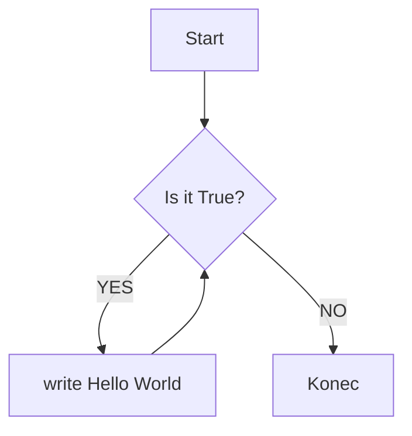
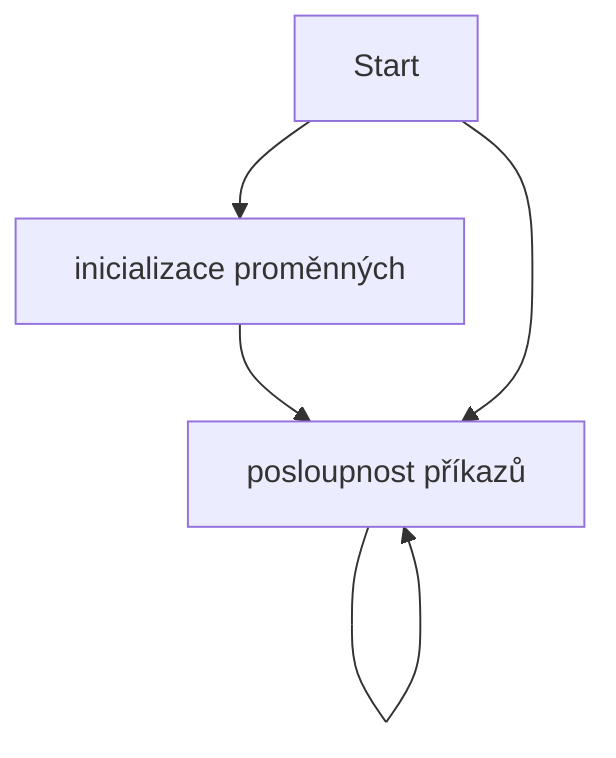

# Lekce 1
### aneb proč se učit programovat

### Obsah
[1. Motivace](#motivace)  
[2. Prostředky](#resources)  
[2.1 Jazyk MicroPython](#lang)  
[2.2 Algoritmus](#alg)  
[2.2.1 Vlatnosti algoritmů](#alg-prop)  
[2.2.2 Vývojový diagram](#vd)  
[2.3 Micro:Bit](#mbit)  
[2.4 IDE](#ide)  
[3. Úloha 1 - Hello World](#hello-world)  
[4. Shrnutí](#shrnuti)  
[5. Poznámky pro učitele](#pozn)  

## Motivace <a name="motivace"/>
Otázky na úvod:
1. Jaká je Vaše zkušenost s programováním?
2. Co si myslíte, že programátor dělá?
3. Potřebuji umět programovat? Proč?

### Problém velkého množství položek
Představte si, že máte velké množství fotografií, které chcete přejmenovat. Přejmenování by vám zabralo neúměrné množství času. Vytvoření skriptu může zabrat pár minut práce. Přejmenování proběhne také poměrně rychle. Deset minut psaní skriptu nebo hodiny ruční práce?

Jako další příklad si představte strukturovaný soubor s daty, např. CSV. Takovýto soubor má tisíce řádků. Řekněme, že nás zajímají nějaké četnosti a další statistiky tohoto souboru dat.

Nejenže je taková práce zdlouhavá, ale je také jednotvárná a nudná.
Taková práce se může i opakovat, a to už je typický příklad využití automatizace. V tomto případě si představte, že zpracováváte soubor s odjezdy autobusů a každý den hledáte spoje s největším zpožděním.

## Prostředky <a name="resources"/>

### Jazyk MicroPython <a name="lang"/>
Žáci by se dle RVP měli na základní škole setkat s algoritmizací, k čemuž jsou, právě blokové jazyky vhodné a často využívané. Ukázka, jak daný kód vypadá v blocích, které již znají, značně ulehčí přechod k Pythonu.

Python je vysokoúrovňový, interpretovaný programovací jazyk, který nabízí podporu pro různá programovací paradigmata. V případě micro:bitů si vystačíme s imperativním. Je dynamicky typovaný a tedy by žáci po přechodu z bloků nemuseli mít zásadní problém. Syntaxe je založena na oddělování kódu pomocí bílých znaků, které oddělují jednotlivé bloky a přispívají k dobré čitelnosti. Zároveň tento způsob zápisu do jisté míry připomíná práci s bloky, které zapadají do sebe a tvoří podobnou strukturu.

Python je zvolen z mnoha důvodů. Jedním z nich je jednoduchá syntaxe. Například v porovnání s jazyky Java nebo C klade Python důraz na čitelnost a jednoduchost kódu. Stručná syntaxe jazyka umožňuje vyjadřovat mnohé koncepty v nižším počtu řádků kódu a udržovat tak v kódu přehlednost. I proto se stále více výzkumníků shoduje, že Python  je vhodný programovací jazyk pro začátečníky.

Ačkoli se pro výuku programování stále využívají i jiné jazyky žáci v nich obvykle čelí problémům, u naprostých začátečníků jde často o syntaxi.

V Pythonu se žáci z počátku nemusí zabývat třídami, metodami a jinými složitějšími konstrukty.
<a name="alg"/>
### Algoritmus
Algoritmus je postup nebo soubor kroků, které jsou navrženy tak, aby řešily určitý problém nebo vykonávaly určitou úlohu. Algoritmus může být popsán jako postup instrukcí, které jsou navrženy tak, aby byly provedeny v určitém pořadí a řídily tok dat, aby bylo dosaženo určeného výstupu.

V informatice se algoritmus používá především k řešení problémů a ke vytváření programů.

Dobře navržený algoritmus je maximálně efektivní, což umožňuje vykonávat úlohy v kratším čase. U algoritmů se proto často bere v úvahu rozlišuje časová a prostorová složitost.

Algoritmus se také používá jako nástroj pro analýzu a návrh procesů a systémů, protože umožňuje rozdělit složité problémy na menší části, které se snáze řeší.

#### <a name="alg-prop"/> Vlastnosti algoritmů

**Rezultativnost**: Algoritmus vždy vede k výsledku.

**Konečnost**: Algortimus musí vždy skončit.

**Obecnost**: Algoritmus by měl být obecný, což znamená, že by měl být použitelný pro různé vstupy a podobné problémy.

**Jednoznačnost**: Algoritmus pro stejné vstupy poskytuje stejné vástupy. Výsledek je ovlivněn pouze vstupem.

#### <a name="vd"/> Vývojový diagram
.

Kostra většiny úloh připravených lekcí:


### Micro:Bit <a name="mbit"/>
Micro:bit je programovatelný mikropočítač, jeho velikost je pouze 4 x 5 cm, přesto však skýtá mnoho funkcí. Má vestavěný displej, dvě tlačítka a několik vestavěných senzorů, například pro detekci pohybu, snímání teploty a světla. Další senzory je možné dokoupit a připojit.

Micro:bit lze programovat bez ohledu na platformu, což zlepšuje dostupnost. Program se do Micro:bitu přenáší pomocí bezdrátové komunikace Bluetooth nebo pomocí přiloženého micro USB kabelu.

### IDE <a name="ide"/>
Jako vhodný editor byl vybrán webový python.microbit.org, se kterým se bude ve všech lekcích pracovat (podrobnosti výběru a další alternativy jsou popsány v kapitole 3.2).
Editor python.microbit.org má tlačítko pro snadný přenos kódu do microbitu, je přívětivý pro začínající programátory, snadno se používá, má sériový výstup. Výhodou python.microbit.org je preview micro:bitu, ovšem bez modulů. Další předností je panel reference, nebo-li dokumentace, která umožňuje vyhledání kódu, klíčových slov nebo dokonce řídících struktur přímo v editoru. Navíc je ještě možné tento kód drag&drop nebo kopírováním přenést do editoru, zeditovat a ihned použít. Editor python.microbit.org je webová aplikace, která umožňuje spustit editor odkudkoli, což studentům usnadňuje samostudium.

## Úloha 1 - Hello World <a name="hello-world"/>
### Zadání
Napište program, který na vestavěný displej vypíše řetězec Hello World. Následně program nahrajte do micro:bitu.
### Co budete potřebovat
K této úloze nejsou potřebné žádné senzory ani Nezha sada.
### Co se naučíte
Cílem úlohy je především vytvoření prvního programu v MicroPythonu. Dále prakticky seznámit žáky s IDE a micro:bitem a program nahrát z počítače do micro:bitu. 
### Vzorová implementace
```python
from microbit import *

while True:
    display.scroll('Hello World')
```
### Popis řešení
Na prvním řádku jsou z modulu microbit je importováno vše co obsahuje. V tomto konkrétním případě lze import celé obsahu nahradit pouze importem objektu display, který pro tuto úlohu stačí.
Protože se celý řetězec na maticový displej micro:bitu nevejde, využijte metodu scroll na objektu display, které předáte jako parametr požadovaný textový řetězec "Hello World". Pro opětovná zobrazení bez nutnosti restartování programu obalte příkaz do nekonečného while cyklu.

Do micro:bitu program z počítače nahrajte pomocí přiloženého micro USB kabelu. 

TODO návod jak nahrát

### Doplňující poznámky
Cykly budou žákům podrobněji vysvětleny až v lekci 4, do té doby si vystačíme s while True, pro neustálé opakování programu.
V případě zájmu si můžou žáci World substituovat svým jménem.

[//]: # (pozn.: Úlohy v následujích lekcích budou řešeny v samostatných souborech v adresáři reseni.)


## Shrnutí <a name="shrnuti"/>
shrnutí

## Poznámky pro učitele <a name="pozn"/>
Pro začátek žákům zatajte existenci tříd, objektů a metod. Budeme se tomu věnovat v pozdějších lekcích.

Micro:bit je možné díky webovému editoru programovat i přes telefon nebo tablet, v takovém případě pro nahrání programu do micro:bitu využijte připojení pomocí bluetooth. 
