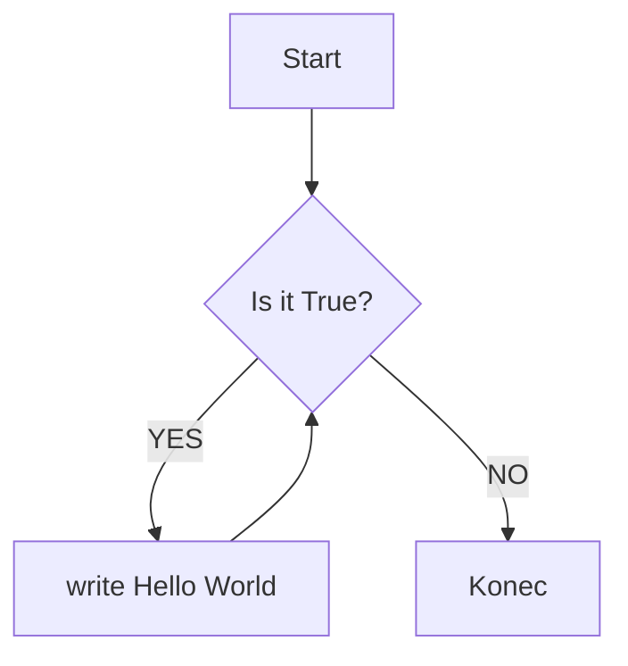
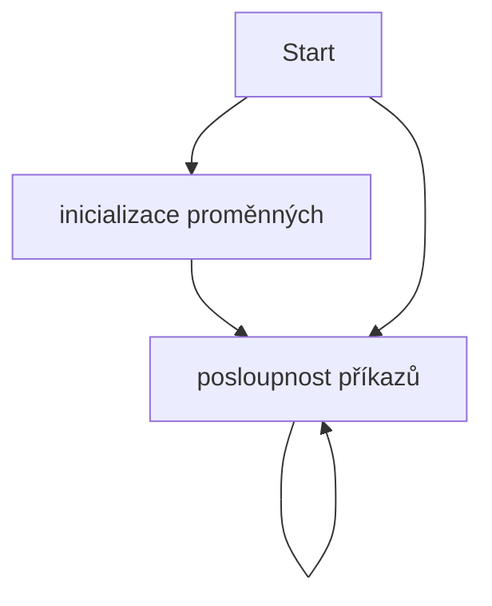

# Lekce 1
### aneb proč se učit programovat

### Obsah
[1. Motivace](#motivace)  
[2. Prostředky](#resources)  
[2.1 Jazyk MicroPython](#lang)  
[2.2 Algoritmus](#alg)  
[2.2.1 Vlatnosti algoritmů](#alg-prop)  
[2.2.2 Vývojový diagram](#vd)  
[2.3 Micro:Bit](#mbit)  
[2.4 IDE](#ide)  
[3. Hello World](#hello-world)  
[4. Struktura lekcí](#strlek)  
[5. Poznámky pro učitele](#pozn)  
<a name="motivace"/>
## Motivace
Jaká je Vaše zkušenost s programováním?

Co si myslíte, že programátor dělá?

Potřebuji umět programovat? Proč?
### Problém velkého množství položek
Představte si, že máte velké množství fotografií, které chcete přejmenovat. Přejmenování by vám zabralo neúměrné množství času. Vytvoření skriptu může zabrat pár minut práce. Přejmenování proběhne také poměrně rychle. Deset minut psaní skriptu nebo hodiny ruční práce?

Jako další příklad si představte strukturovaný soubor s daty, např. CSV. Takovýto soubor má tisíce řádků. Řekněme, že nás zajímají nějaké četnosti a další statistiky tohoto souboru dat.

Nejenže je taková práce zdlouhavá, ale je také jednotvárná a nudná.
Taková práce se může i opakovat, a to už je typický příklad využití automatizace. V tomto případě si představte, že zpracováváte soubor s odjezdy autobusů a každý den hledáte spoje s největším zpožděním.
<a name="resources"/>
## Prostředky
.
<a name="lang"/>
### Jazyk MicroPython
Žáci by se dle RVP měli na základní škole setkat s algoritmizací, k čemuž jsou, právě blokové jazyky vhodné a často využívané. Ukázka, jak daný kód vypadá v blocích, které již znají, značně ulehčí přechod k Pythonu.

Python je vysokoúrovňový, interpretovaný programovací jazyk, který nabízí podporu pro různá programovací paradigmata. V případě micro:bitů si vystačíme s imperativním. Je dynamicky typovaný a tedy by žáci po přechodu z bloků nemuseli mít zásadní problém. Syntaxe je založena na oddělování kódu pomocí bílých znaků, které oddělují jednotlivé bloky a přispívají k dobré čitelnosti. Zároveň tento způsob zápisu do jisté míry připomíná práci s bloky, které zapadají do sebe a tvoří podobnou strukturu.

Python je zvolen z mnoha důvodů. Jedním z nich je jednoduchá syntaxe. Například v porovnání s jazyky Java nebo C klade Python důraz na čitelnost a jednoduchost kódu. Stručná syntaxe jazyka umožňuje vyjadřovat mnohé koncepty v nižším počtu řádků kódu a udržovat tak v kódu přehlednost. I proto se stále více výzkumníků shoduje, že Python  je vhodný programovací jazyk pro začátečníky.

Ačkoli se pro výuku programování stále využívají i jiné jazyky žáci v nich obvykle čelí problémům, u naprostých začátečníků jde často o syntaxi.

V Pythonu se žáci z počátku nemusí zabývat třídami, metodami a jinými složitějšími konstrukty.
<a name="alg"/>
### Algoritmus
Algoritmus je postup nebo soubor kroků, které jsou navrženy tak, aby řešily určitý problém nebo vykonávaly určitou úlohu. Algoritmus může být popsán jako postup instrukcí, které jsou navrženy tak, aby byly provedeny v určitém pořadí a řídily tok dat, aby bylo dosaženo určeného výstupu.

V informatice se algoritmus používá především k řešení problémů a ke vytváření programů.

Dobře navržený algoritmus je maximálně efektivní, což umožňuje vykonávat úlohy v kratším čase. U algoritmů se proto často bere v úvahu rozlišuje časová a prostorová složitost.

Algoritmus se také používá jako nástroj pro analýzu a návrh procesů a systémů, protože umožňuje rozdělit složité problémy na menší části, které se snáze řeší.

#### <a name="alg-prop"/> Vlastnosti algoritmů

**Rezultativnost**: Algoritmus vždy vede k výsledku.

**Konečnost**: Algortimus musí vždy skončit.

**Obecnost**: Algoritmus by měl být obecný, což znamená, že by měl být použitelný pro různé vstupy a podobné problémy.

**Jednoznačnost**: Algoritmus pro stejné vstupy poskytuje stejné vástupy. Výsledek je ovlivněn pouze vstupem.

#### <a name="vd"/> Vývojový diagram
.

Kostra většiny úloh připravených lekcí:


### Micro:Bit <a name="mbit"/>
Micro:bit je programovatelný mikropočítač, jeho velikost je pouze 4 x 5 cm, přesto však skýtá mnoho funkcí. Má vestavěný displej, dvě tlačítka a několik vestavěných senzorů, například pro detekci pohybu, snímání teploty a světla. Další senzory je možné dokoupit a připojit.


Micro:bit lze programovat bez ohledu na platformu, což zlepšuje dostupnost. Program se do Micro:bitu přenáší pomocí bezdrátové komunikace Bluetooth nebo pomocí přiloženého micro USB kabelu.
### IDE <a name="ide"/>

## Hello World <a name="hello-world"/>
Vypište na vestavěný displej řetězec Hello World.

V případě zájmu si můžou žáci World substituovat svým jménem.

--- řešení ---
```python
from microbit import *

while True:
    display.scroll('Hello World')
```
Protože se celý řetězec na displej nevejde, využijte metodu scroll na objektu display. Pro opětovná zobrazení bez nutnosti restartování programu obalte direktivu do while cyklu.

pozn.: Úlohy v následujích lekcích budou řešeny v samostatných souborech v adresáři reseni.

## Struktura lekcí <a name="strlek"/>
1. Zadání úlohy

2. Potřebné senzory, schéma zapojení

3. Odkaz na potřebné moduly - v adresáři moduly

4. Odkaz na soubor s řešením - v adresáři reseni

## Poznámky pro učitele <a name="pozn"/>
Pro začátek žákům zatajte existenci tříd, objektů a metod. Budeme se tomu věnovat v pozdějších lekcích.

Pro náhrávání programu do Micro:Bita oporučuji využít přiložený kabel, vyhnete se potížím, které se s bezdrátovými technologiemi pojí.
