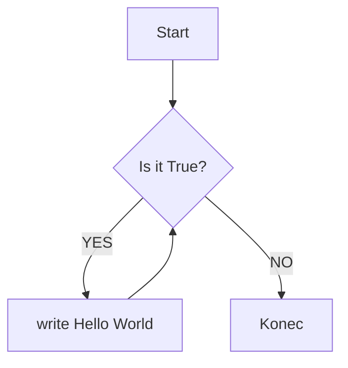

# Lekce 1
### aneb proč se učit programovat

### Obsah
[1. Motivace](#motivace)  
[2. Prostředky](#prostredky)  
[2.1 Jazyk MicroPython](#lang)  
[2.2 Algoritmus](#alg)  
[2.2.1 Vývojový diagram](#vd)  
[2.3 Micro:Bit](#mbit)  
[2.4 IDE](#ide)  
[3. Hello World](#hello-world)  
[4. Struktura lekcí](#strlek)  
[5. Poznámky pro učitele](#pozn)  
<a name="motivace"/>
## Motivace
Jaká je Vaše zkušenost s programováním?

Co si myslíte, že programátor dělá?

Potřebuji umět programovat? Proč?
### Problém velkého množství položek
Představte si, že máte velké množství fotografií, které chcete přejmenovat. Přejmenování by vám zabralo neúměrné množství času. Vytvoření skriptu může zabrat pár minut práce. Přejmenování proběhne také poměrně rychle. Deset minut psaní skriptu nebo hodiny ruční práce?

Jako další příklad si představte strukturovaný soubor s daty, např. CSV. Takovýto soubor má tisíce řádků. Řekněme, že nás zajímají nějaké četnosti a další statistiky tohoto souboru dat.

Nejenže je taková práce zdlouhavá, ale je také jednotvárná a nudná.
Taková práce se může i opakovat, a to už je typický příklad využití automatizace. V tomto případě si představte, že zpracováváte soubor s odjezdy autobusů a každý den hledáte spoje s největším zpožděním.
<a name="prostredky"/>
## Prostředky
.
<a name="lang"/>
### Jazyk MicroPython
.
<a name="alg"/>
### Algoritmus
.
<a name="vd"/>
#### Vývojový diagram
.

.
<a name="mbit"/>
### Micro:Bit
.
<a name="ide"/>
### IDE
.
<a name="hello-world"/>
## Hello World
Vypište na vestavěný displej řetězec Hello World.

V případě zájmu si můžou žáci World substituovat svým jménem.
--- řešení ---
```python
from microbit import *

while True:
    display.scroll('Hello World')
```
.
<a name="strlek"/>
## Struktura lekcí
.
<a name="pozn"/>
## Poznámky pro učitele
.
